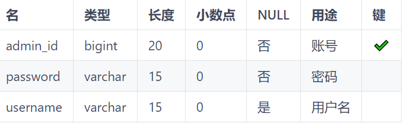

# SSM_LibrarySystem

#### 介绍
基于Spring+SpringMVC+Mybatis的图书管理系统

一.功能分析

- （1）管理员：图书管理，读者管理，借还管理
- （2）读者用户：借阅/归还图书

二.开发环境

    Windows 10，IntelliJ IDEA 2020.2，mysql5.5
	
三.项目结构设计

- （1）java目录：java类文件，包含bean、controller、dao、service四个包，用于操作数据库、相应前端页面等
- （2）resources目录：包含数据库连接池配置文件和数据库操作的xml文件
- （3）webapp目录：包含static和WEB-INF两个包，static中包含js、css、images资源；WEB-INF中包含web配置文件和jsp前端页面

四.数据库library设计：

- （1）图书目录表book_info

- （2）管理员表admin

- （3）图书分类表class_info

- （4）借阅信息表lend_list

- （5）借阅卡信息表reader_card

- （6）读者信息表

五.维护日志

- （1）bug内容：图书添加、修改功能，读者用户添加、修改功能，图书搜索功能等无法正常使用
- （2）bug定位：数据库操作错误，字符长度超出设定，中文乱码问题，推断为字符编码问题
- （3）bug原因：Tomcat中使用post方法提交表单时，默认采用的编码方式为ISO-8859-1，因此需要将编码方式转为UTF-8    
- （4）bug解决：使用String name = new String(name.getBytes("ISO-8859-1"), "UTF-8")进行转换

